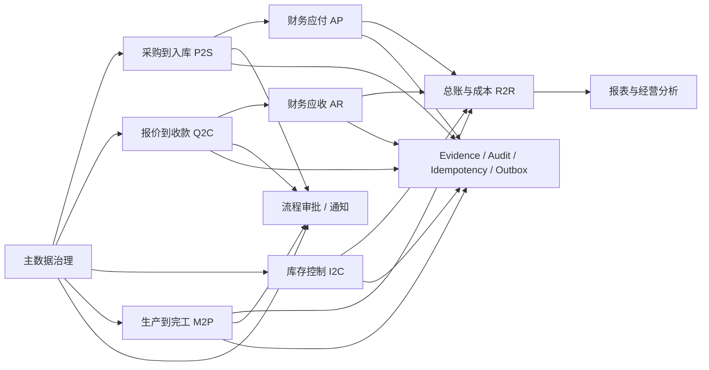

# miniERP ERP 总体架构与主业务流程蓝图

## 1. 文档定位

本文件基于以下三类输入统一整理：

- 调研设计源：[ERP系统UI设计与域模型研究.md](/Users/haoqi/Library/Mobile%20Documents/iCloud~md~obsidian/Documents/private_knowlegde/%E5%BC%80%E5%8F%91%E9%97%AE%E9%A2%98/ERP%E7%B3%BB%E7%BB%9FUI%E8%AE%BE%E8%AE%A1%E4%B8%8E%E5%9F%9F%E6%A8%A1%E5%9E%8B%E7%A0%94%E7%A9%B6.md)
- 当前共享契约：[domain.ts](/Users/haoqi/OnePersonCompany/miniERP/packages/shared/src/types/domain.ts)
- 当前数据库现状：[schema.prisma](/Users/haoqi/OnePersonCompany/miniERP/apps/server/prisma/schema.prisma)

目标是统一回答 4 个问题：

1. miniERP 的目标总体架构是什么
2. 应该有哪些表与字段
3. 前端页面树应该怎么组织
4. 主业务流程应该怎么串起来

---

## 2. 总体架构

miniERP 的目标是一个完整 ERP，不是单纯的采购销售库存系统。整体分 6 层：

```text
平台与权限层
├─ tenant / company / org_unit / user / role / permission / data scope

主数据层
├─ customer / supplier / item / bom / warehouse / uom / tax_code

业务单据与库存层
├─ quotation / purchase_order / goods_receipt / sales_order / shipment
├─ stocktake / inventory_txn / inventory_ledger / inventory_balance

制造与质量层
├─ production_order / work_order / qc_record

财务核算层
├─ invoice / receipt / payment / journal_entry / gl_account
├─ cost_center / project / budget / fiscal_period

流程与横切能力层
├─ workflow / approval / notification
├─ report / dashboard
├─ integration / api client / api logs
└─ evidence / audit / state_transition / idempotency / outbox
```

### 2.1 命名迁移规则

目标域名已经确定，旧名只作为迁移兼容：

| 旧命名 | 目标命名 |
|---|---|
| `sku` | `item` |
| `sku_mapping` | `item_mapping` |
| `sku_substitution` | `item_substitution` |
| `grn` | `goods_receipt` |
| `outbound` | `shipment` |

### 2.2 核心工程约束

- 库存事实源只能是 `inventory_ledger`
- `inventory_balance` 只能做查询投影
- 所有金额/税额/数量统一 Decimal
- 所有写操作都必须带 `tenant_id` 和审计字段
- 所有过账接口都必须带 `Idempotency-Key`
- 单据号遵循 `DOC-{type}-{YYYYMMDD}-{seq}`
- 单据不能物理删除，只能作废/冲销

---

## 3. 公共字段规范

为避免每张表重复定义，这里先抽出 4 个公共字段集合。

### 3.1 审计基础字段

```text
id
tenant_id
company_id?
org_id?
status
ext?                  # json 扩展位
created_at
created_by
updated_at
updated_by
deleted_at?
deleted_by?
```

### 3.2 单据头基础字段

```text
id
tenant_id
company_id?
org_id?
doc_no
doc_date
status
remarks?
ext?
created_at
created_by
updated_at
updated_by
deleted_at?
deleted_by?
```

### 3.3 单据行基础字段

```text
id
tenant_id
parent_id
line_no
ext?
created_at
created_by?
updated_at?
updated_by?
```

### 3.4 金额与数量规则

```text
qty / amount / tax_amount / total_amount / total_with_tax / debit / credit / unit_price
统一使用 Decimal
```

---

## 4. 目标表结构与字段清单

以下是目标完整版模型，不是“当前 Prisma 已全部实现”的意思。

## 4.1 平台与租户

### tenant

```text
tenant_id
tenant_code
tenant_name
plan
timezone
locale
status
ext
created_at
updated_at
```

### company

```text
company_id
tenant_id
company_code
company_name
unified_social_credit_code
base_currency
fiscal_year_variant
default_tax_region
status
ext
created_at
created_by
updated_at
updated_by
```

### org_unit

```text
org_id
tenant_id
company_id
org_code
org_name
org_type                # dept / bu / plant / inventory / finance
parent_org_id?
manager_user_id?
status
ext
created_at
created_by
updated_at
updated_by
```

### user

```text
user_id
tenant_id
login_name
display_name
mobile?
email?
password_hash?
mfa_enabled?
last_login_at?
status
ext
created_at
created_by
updated_at
updated_by
```

### role

```text
role_id
tenant_id
role_code
role_name
description?
status
ext
created_at
created_by
updated_at
updated_by
```

### permission

```text
perm_id
tenant_id
perm_code
perm_type               # menu / button / api / data
resource
action
effect                  # allow / deny
description?
status
ext
created_at
created_at
```

### user_role

```text
user_role_id
tenant_id
user_id
role_id
effective_from?
effective_to?
status
created_at
created_by
```

### role_permission

```text
role_permission_id
tenant_id
role_id
perm_id
created_at
created_by
```

### user_org_scope

```text
scope_id
tenant_id
user_id
company_id?
org_id?
warehouse_id?
project_id?
scope_type
status
created_at
created_by
```

## 4.2 主数据

### customer

```text
customer_id
tenant_id
company_id
org_id?
customer_code
customer_name
taxpayer_id_or_uscc?
invoice_title?
billing_address?
billing_phone?
bank_name?
bank_account?
contact_name?
contact_mobile?
credit_limit?
payment_term?
default_tax_code_id?
status
ext
created_at
created_by
updated_at
updated_by
deleted_at?
deleted_by?
```

### supplier

```text
supplier_id
tenant_id
company_id
org_id?
supplier_code
supplier_name
taxpayer_id_or_uscc?
payee_bank?
payee_account?
contact_name?
contact_mobile?
payment_term?
default_tax_code_id?
status
ext
created_at
created_by
updated_at
updated_by
deleted_at?
deleted_by?
```

### item

```text
item_id
tenant_id
company_id
org_id?
item_code
item_name
spec_model?
item_type?
category_id?
uom_code
tax_code_id?
tax_rate?
barcode?
batch_managed?
serial_managed?
shelf_life_days?
min_stock_qty?
max_stock_qty?
lead_time_days?
status
ext
created_at
created_by
updated_at
updated_by
deleted_at?
deleted_by?
```

### item_mapping

```text
mapping_id
tenant_id
item_id
source_system
external_item_code
external_item_name?
status
ext
created_at
created_by
updated_at
updated_by
```

### item_substitution

```text
substitution_id
tenant_id
item_id
substitute_item_id
substitution_group?
priority?
effective_from?
effective_to?
status
ext
created_at
created_by
updated_at
updated_by
```

### bom

```text
bom_id
tenant_id
company_id
org_id?
bom_code
parent_item_id
version
effective_from?
effective_to?
bom_type?
status
ext
created_at
created_by
updated_at
updated_by
```

### bom_line

```text
bom_line_id
tenant_id
bom_id
line_no
component_item_id
qty
uom_code
scrap_rate?
substitute_group?
sequence?
ext
created_at
created_by
```

### warehouse

```text
warehouse_id
tenant_id
company_id
org_id
warehouse_code
warehouse_name
warehouse_type?
address?
contact_name?
contact_mobile?
manage_bin?
status
ext
created_at
created_by
updated_at
updated_by
```

### warehouse_bin

```text
bin_id
tenant_id
warehouse_id
bin_code
bin_name
zone_code?
bin_type?
status
ext
created_at
created_by
updated_at
updated_by
```

### uom

```text
uom_id
tenant_id
company_id
uom_code
uom_name
precision?
status
ext
created_at
created_by
updated_at
updated_by
```

### tax_code

```text
tax_code_id
tenant_id
company_id
tax_code
tax_name
tax_type
rate
inclusive?
jurisdiction?
status
ext
created_at
created_by
updated_at
updated_by
```

## 4.3 业务单据与库存

### quotation

```text
quote_id
tenant_id
company_id
org_id
quote_no
customer_id
quote_date
valid_until?
currency?
exchange_rate?
total_amount
tax_amount?
total_with_tax?
current_version_no?
status
remarks?
ext
created_at
created_by
updated_at
updated_by
deleted_at?
deleted_by?
```

### quotation_version

```text
quote_version_id
tenant_id
quote_id
version_no
pricing_strategy?
total_amount
tax_amount?
total_with_tax?
status
ext
created_at
created_by
```

### quotation_line

```text
quote_line_id
tenant_id
quote_version_id
line_no
item_id
item_name_snapshot?
spec_model_snapshot?
qty
uom
unit_price
tax_rate?
amount
tax_amount?
delivery_date?
ext
created_at
created_by
```

### purchase_order

```text
doc_base
supplier_id
warehouse_id?
currency?
exchange_rate?
tax_included?
total_qty
total_amount
tax_amount?
total_with_tax?
expected_receipt_date?
approval_status?
source_ref_type?
source_ref_id?
```

### purchase_order_line

```text
po_line_id
tenant_id
po_id
line_no
item_id
item_name_snapshot?
spec_model_snapshot?
qty
received_qty?
uom
unit_price
tax_rate?
amount
tax_amount?
warehouse_id?
delivery_date?
line_status?
ext
created_at
created_by
```

### goods_receipt

```text
doc_base
po_id?
supplier_id?
warehouse_id
total_qty
total_amount?
tax_amount?
total_with_tax?
receipt_type?
posted_at?
source_ref_type?
source_ref_id?
```

### goods_receipt_line

```text
gr_line_id
tenant_id
goods_receipt_id
line_no
item_id
qty
accepted_qty?
rejected_qty?
uom
unit_price?
amount?
batch_no?
serial_no?
bin_id?
source_po_line_id?
ext
created_at
created_by
```

### sales_order

```text
doc_base
customer_id
warehouse_id?
currency?
exchange_rate?
total_qty
total_amount
tax_amount?
total_with_tax?
ship_date?
approval_status?
source_ref_type?
source_ref_id?
```

### sales_order_line

```text
so_line_id
tenant_id
so_id
line_no
item_id
item_name_snapshot?
spec_model_snapshot?
qty
shipped_qty?
uom
unit_price
tax_rate?
amount
tax_amount?
warehouse_id?
delivery_org?
delivery_date?
line_status?
ext
created_at
created_by
```

### shipment

```text
doc_base
so_id?
customer_id?
warehouse_id
total_qty
picking_status?
posted_at?
carrier?
tracking_no?
handover_status?
source_ref_type?
source_ref_id?
```

### shipment_line

```text
shipment_line_id
tenant_id
shipment_id
line_no
item_id
qty
uom
batch_no?
serial_no?
from_bin_id?
to_bin_id?
source_so_line_id?
ext
created_at
created_by
```

### stocktake

```text
doc_base
warehouse_id
stocktake_scope?
owner_user_id?
counted_line_count?
variance_qty?
posted_at?
source_ref_type?
source_ref_id?
```

### stocktake_line

```text
stocktake_line_id
tenant_id
stocktake_id
line_no
item_id
system_qty
counted_qty
diff_qty
uom
batch_no?
serial_no?
bin_id?
reason_code?
ext
created_at
created_by
```

### inventory_txn

```text
inv_txn_id
tenant_id
company_id
org_id
txn_no
txn_type                 # receipt / issue / transfer / adjust
biz_date
warehouse_id
source_doc_type?
source_doc_id?
posted_at?
status
remarks?
ext
created_at
created_by
updated_at
updated_by
```

### inventory_txn_line

```text
txn_line_id
tenant_id
inv_txn_id
line_no
item_id
qty
uom
batch_no?
serial_no?
from_bin_id?
to_bin_id?
unit_cost?
cost_amount?
ext
created_at
created_by
```

### inventory_ledger

```text
ledger_id
tenant_id
company_id
org_id
item_id
warehouse_id
bin_id?
batch_no?
serial_no?
quantity_delta
balance_after?
unit_cost?
cost_amount?
reference_type
reference_id
reference_line_id?
reversal_of_ledger_id?
request_id?
posted_at
created_at
```

### inventory_balance

```text
balance_id
tenant_id
company_id
org_id
item_id
warehouse_id
bin_id?
batch_no?
serial_no?
on_hand_qty
available_qty
reserved_qty
in_transit_qty?
frozen_qty?
last_move_at?
updated_at
```

## 4.4 制造与质量

### production_order

```text
mo_id
tenant_id
company_id
org_id
mo_no
product_item_id
bom_id?
plan_qty
completed_qty?
plan_start_date?
plan_end_date?
actual_start_date?
actual_end_date?
warehouse_id?
status
remarks?
ext
created_at
created_by
updated_at
updated_by
```

### work_order

```text
wo_id
tenant_id
company_id
org_id
wo_no
mo_id
operation?
work_center?
plan_qty
actual_qty?
scrap_qty?
start_at?
end_at?
status
remarks?
ext
created_at
created_by
updated_at
updated_by
```

### qc_record

```text
qc_id
tenant_id
company_id
org_id
qc_no
qc_type                   # incoming / inprocess / outgoing
ref_doc_type
ref_doc_id
ref_line_id?
item_id
batch_no?
serial_no?
result
defect_code?
disposition?
inspector_user_id
qc_time
remarks?
ext
created_at
created_by
updated_at
updated_by
```

## 4.5 财务核算

### invoice

```text
inv_id
tenant_id
company_id
org_id
inv_no
invoice_type               # AR / AP
issue_date
fiscal_period_id?
buyer_party_id?
seller_party_id?
currency?
exchange_rate?
amount
tax_amount
total_with_tax
e_invoice_no?
invoice_code?
archive_format?
archive_uri?
status
source_ref_type?
source_ref_id?
remarks?
ext
created_at
created_by
updated_at
updated_by
```

### invoice_line

```text
inv_line_id
tenant_id
inv_id
line_no
item_id?
item_name
spec_model?
uom?
qty?
unit_price?
amount
tax_rate
tax_amount
source_ref_type?
source_ref_id?
source_ref_line_id?
ext
created_at
created_by
```

### receipt

```text
receipt_id
tenant_id
company_id
org_id
receipt_no
customer_id
receipt_date
currency?
amount
method
bank_account_id?
matched_amount?
status
remarks?
ext
created_at
created_by
updated_at
updated_by
```

### receipt_allocation

```text
receipt_alloc_id
tenant_id
receipt_id
line_no
invoice_id
allocated_amount
exchange_gain_loss_amount?
ext
created_at
created_by
```

### payment

```text
payment_id
tenant_id
company_id
org_id
payment_no
supplier_id
payment_date
currency?
amount
method
bank_account_id?
matched_amount?
status
remarks?
ext
created_at
created_by
updated_at
updated_by
```

### payment_allocation

```text
payment_alloc_id
tenant_id
payment_id
line_no
invoice_id
allocated_amount
exchange_gain_loss_amount?
ext
created_at
created_by
```

### gl_account

```text
gl_id
tenant_id
company_id
account_code
account_name
account_type               # asset / liability / equity / revenue / expense
currency_control?
parent_gl_id?
status
ext
created_at
created_by
updated_at
updated_by
```

### journal_entry

```text
je_id
tenant_id
company_id
org_id?
je_no
posting_date
fiscal_period_id
source                     # manual / auto
source_ref_type?
source_ref_id?
total_debit
total_credit
status
remarks?
ext
created_at
created_by
updated_at
updated_by
```

### journal_entry_line

```text
je_line_id
tenant_id
je_id
line_no
gl_id
debit?
credit?
cc_id?
project_id?
description?
source_ref_type?
source_ref_id?
ext
created_at
created_by
```

### cost_center

```text
cc_id
tenant_id
company_id
org_id?
cc_code
cc_name
manager_user_id?
status
ext
created_at
created_by
updated_at
updated_by
```

### project

```text
project_id
tenant_id
company_id
org_id?
project_code
project_name
owner_user_id?
start_date?
end_date?
budget_id?
status
ext
created_at
created_by
updated_at
updated_by
```

### budget

```text
budget_id
tenant_id
company_id
budget_code
budget_name
fiscal_year
currency
status
ext
created_at
created_by
updated_at
updated_by
```

### budget_line

```text
budget_line_id
tenant_id
budget_id
line_no
cc_id?
project_id?
gl_id?
amount
period_from?
period_to?
ext
created_at
created_by
```

### fiscal_period

```text
period_id
tenant_id
company_id
fiscal_year
period_code
start_date
end_date
close_status
closed_at?
closed_by?
ext
created_at
created_by
updated_at
updated_by
```

## 4.6 流程、报表、集成与横切能力

### workflow_instance

```text
wf_id
tenant_id
company_id?
org_id?
wf_def_id
biz_doc_type
biz_doc_id
biz_doc_no?
status
started_at
ended_at?
current_node?
ext
created_at
created_by
```

### approval_task

```text
task_id
tenant_id
wf_id
assignee_user_id
node_name
due_at?
decision?
decided_at?
comment?
status
ext
created_at
created_by
updated_at
updated_by
```

### notification

```text
notif_id
tenant_id
user_id
channel                    # inapp / sms / email
title
content
source_type
source_id
read_at?
status
ext
created_at
```

### report_definition

```text
report_id
tenant_id
company_id?
report_code
report_name
dataset_ref
owner_role_id?
refresh_policy
status
ext
created_at
created_by
updated_at
updated_by
```

### dashboard_definition

```text
dash_id
tenant_id
company_id?
dash_code
dash_name
layout_json
filters_json?
owner_role_id?
status
ext
created_at
created_by
updated_at
updated_by
```

### integration_endpoint

```text
ep_id
tenant_id
ep_code
endpoint_name?
base_url
auth_type
secret_ref
rate_limit_json?
timeout_ms?
status
ext
created_at
created_by
updated_at
updated_by
```

### integration_job

```text
job_id
tenant_id
ep_id
job_code
job_name?
schedule
last_run_at?
next_run_at?
retry_policy_json?
status
ext
created_at
created_by
updated_at
updated_by
```

### integration_log

```text
log_id
tenant_id
job_id
run_at
result
error_message?
request_payload_ref?
response_payload_ref?
correlation_id?
status_code?
ext
created_at
```

### api_client

```text
client_id
tenant_id
client_code
client_name
secret_hash
scopes_json?
ip_whitelist_json?
status
created_at
created_by
updated_at
updated_by
```

### api_call_log

```text
call_log_id
tenant_id
client_id?
request_id
path
method
status_code
latency_ms
actor_id?
ip?
request_at
response_at?
error_message?
metadata_json?
```

### evidence_asset

```text
asset_id
tenant_id
object_key
file_name
content_type
size_bytes
sha256?
status
uploaded_by?
thumbnail_url?
created_at
```

### evidence_link

```text
link_id
tenant_id
asset_id
entity_type
entity_id
scope                      # document / line
line_ref?
tag
note?
created_at
created_by
```

### attachment_archive

```text
archive_id
tenant_id
entity_type
entity_id
asset_id
archive_format
archive_uri
archived_at
archived_by
retention_until?
ext
```

### audit_log

```text
audit_id
tenant_id
company_id?
org_id?
request_id
actor_id
action
entity_type
entity_id
result
reason?
metadata_json?
occurred_at
```

### state_transition_log

```text
transition_id
tenant_id
company_id?
org_id?
entity_type
entity_id
from_status?
to_status
actor_id
request_id
occurred_at
metadata_json?
```

### idempotency_record

```text
idempotency_id
tenant_id
action_type
idempotency_key
payload_hash
request_id
response_body_json?
status?
created_at
```

### outbox_event

```text
event_id
tenant_id
aggregate_type
aggregate_id
event_type
payload_json
status
created_at
published_at?
```

---

## 5. 当前仓库已落地边界

当前 Prisma 已落地的表：

```text
tenant
user
role
permission
user_role
api_client
api_call_log

sku
sku_mapping
sku_substitution
warehouse
supplier
customer

purchase_order
purchase_order_line
grn
grn_line
sales_order
sales_order_line
outbound
outbound_line
stocktake
stocktake_line
quotation
quotation_version
quotation_line

inventory_ledger
inventory_balance

evidence_asset
evidence_link
audit_log
state_transition_log
idempotency_record
outbox_event
```

### 5.1 已落地但命名仍旧

```text
sku                -> item
sku_mapping        -> item_mapping
sku_substitution   -> item_substitution
grn                -> goods_receipt
outbound           -> shipment
```

### 5.2 目标中仍未真正下沉到 Prisma 的表

```text
company
org_unit
role_permission
user_org_scope
warehouse_bin
uom
tax_code
inventory_txn
inventory_txn_line
production_order
work_order
qc_record
invoice
invoice_line
receipt
receipt_allocation
payment
payment_allocation
gl_account
journal_entry
journal_entry_line
cost_center
project
budget
budget_line
fiscal_period
workflow_instance
approval_task
notification
report_definition
dashboard_definition
integration_endpoint
integration_job
integration_log
attachment_archive
```

---

## 6. 前端页面树型结构

页面模板严格收敛到 T1/T2/T3/T4。

```text
ERP
├─ 工作空间
│  ├─ /workspace [T1]
│  ├─ /workspace/todos [T2]
│  ├─ /workspace/notifications [T2]
│  └─ /workspace/notifications/:id [T3]
├─ 主数据 MDM
│  ├─ /mdm/organizations [T2]
│  ├─ /mdm/users [T2]
│  ├─ /mdm/roles [T2]
│  ├─ /mdm/customers [T2]
│  │  └─ /mdm/customers/:id [T3]
│  ├─ /mdm/suppliers [T2]
│  │  └─ /mdm/suppliers/:id [T3]
│  ├─ /mdm/items [T2]
│  │  ├─ /mdm/items/new [T4]
│  │  └─ /mdm/items/:id [T3]
│  ├─ /mdm/boms [T2]
│  │  └─ /mdm/boms/:id [T3]
│  └─ /mdm/warehouses [T2]
├─ 采购 Procure
│  ├─ /procure/overview [T1]
│  ├─ /procure/purchase-orders [T2]
│  │  ├─ /procure/purchase-orders/new [T4]
│  │  └─ /procure/purchase-orders/:id [T3]
│  └─ /procure/receipts [T2]
│     ├─ /procure/receipts/new [T4]
│     └─ /procure/receipts/:id [T3]
├─ 销售 Sales
│  ├─ /sales/overview [T1]
│  ├─ /sales/quotations [T2]
│  │  ├─ /sales/quotations/new [T4]
│  │  └─ /sales/quotations/:id [T3]
│  ├─ /sales/orders [T2]
│  │  ├─ /sales/orders/new [T4]
│  │  └─ /sales/orders/:id [T3]
│  └─ /sales/shipments [T2]
│     ├─ /sales/shipments/new [T4]
│     └─ /sales/shipments/:id [T3]
├─ 库存 Inventory
│  ├─ /inventory/overview [T1]
│  ├─ /inventory/balances [T2]
│  ├─ /inventory/ledger [T2]
│  ├─ /inventory/adjustments [T2]
│  ├─ /inventory/replenishment [T2]
│  ├─ /inventory/counts [T2]
│  │  ├─ /inventory/counts/new [T4]
│  │  └─ /inventory/counts/:id [T3]
│  └─ /inventory/transfers/new [T4]
├─ 制造 Manufacturing
│  ├─ /manufacturing/overview [T1]
│  ├─ /manufacturing/orders [T2]
│  │  ├─ /manufacturing/orders/new [T4]
│  │  └─ /manufacturing/orders/:id [T3]
│  └─ /manufacturing/work-orders/:id [T3]
├─ 质量 Quality
│  ├─ /quality/records [T2]
│  └─ /quality/records/:id [T3]
├─ 财务 Finance
│  ├─ /finance/overview [T1]
│  ├─ /finance/invoices [T2]
│  │  ├─ /finance/invoices/new [T4]
│  │  └─ /finance/invoices/:id [T3]
│  ├─ /finance/receipts [T2]
│  │  ├─ /finance/receipts/new [T4]
│  │  └─ /finance/receipts/:id [T3]
│  ├─ /finance/payments [T2]
│  │  ├─ /finance/payments/new [T4]
│  │  └─ /finance/payments/:id [T3]
│  ├─ /finance/journals [T2]
│  │  ├─ /finance/journals/new [T4]
│  │  └─ /finance/journals/:id [T3]
│  ├─ /finance/gl-accounts [T2]
│  ├─ /finance/cost-centers [T2]
│  ├─ /finance/budgets [T2]
│  └─ /finance/period-close [T4]
├─ 流程 Workflow
│  ├─ /workflow/tasks [T2]
│  └─ /workflow/tasks/:id [T3]
├─ 报表 Reports
│  ├─ /reports [T1]
│  ├─ /reports/sales [T2]
│  ├─ /reports/purchase [T2]
│  ├─ /reports/inventory [T2]
│  └─ /reports/finance [T2]
├─ 集成 Integration
│  ├─ /integration/endpoints [T2]
│  ├─ /integration/jobs [T2]
│  ├─ /integration/logs [T2]
│  └─ /integration/logs/:id [T3]
└─ 证据 Evidence
   ├─ /evidence/assets [T2]
   └─ /evidence/assets/:id [T3]
```

---

## 7. 主业务流程

## 7.1 流程总图



## 7.2 六条主线

### 1. 主数据治理

```text
组织/公司/权限
-> 客户/供应商/物料/BOM/仓库/税码/单位
-> 供所有业务单据引用
```

### 2. 采购到入库 P2S

```text
purchase_order
-> goods_receipt
-> inventory_txn
-> inventory_ledger
-> inventory_balance
-> AP invoice
-> payment
-> journal_entry
```

### 3. 报价到收款 Q2C

```text
quotation
-> sales_order
-> shipment
-> inventory_txn
-> inventory_ledger
-> AR invoice
-> receipt
-> journal_entry
```

### 4. 库存控制 I2C

```text
transfer / adjustment / stocktake
-> inventory_txn
-> inventory_ledger
-> inventory_balance
```

说明：

- `inventory_ledger` 是唯一事实源
- `inventory_balance` 是查询投影

### 5. 生产到完工 M2P

```text
production_order
-> work_order
-> issue material / report work / completion
-> qc_record
-> inventory_txn
-> inventory_ledger
-> journal_entry
```

### 6. 记录到报表 R2R

```text
业务单据
-> 财务凭证 / 成本归集
-> fiscal_period
-> report_definition / dashboard_definition
```

---

## 8. 当前实施优先级建议

如果按“先做可运行，再做完整版”推进，建议顺序如下：

1. `company / org_unit / item` 真正落库并进入 shared 契约
2. `inventory_txn / inventory_txn_line` 补齐，让库存事务层完整
3. `goods_receipt / shipment` 从旧 `grn / outbound` 完成正式迁移
4. `invoice / receipt / payment / journal_entry / fiscal_period` 一次性补齐
5. `workflow / notification / integration / report` 作为平台能力收口
6. `production_order / work_order / qc_record` 最后并入制造质量域

---

## 9. 结论

miniERP 的目标不应该是“几个工作台页面”，而应该是：

- 以 `company / org_unit / item` 为新的根主数据
- 以 `inventory_ledger` 为唯一库存事实源
- 以 `quotation / purchase / sales / finance / workflow / evidence` 为统一业务骨架
- 以前端 T1/T2/T3/T4 模板和 BFF 作为唯一 UI/接口入口

这份文档可作为后续三类工作的统一基线：

- 数据库迁移
- 路由与页面补齐
- 主业务流程验收
