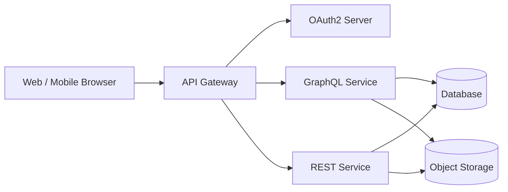
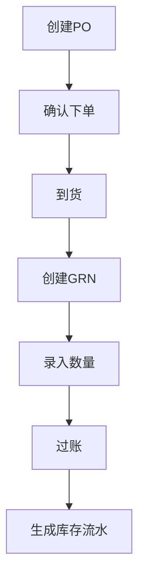
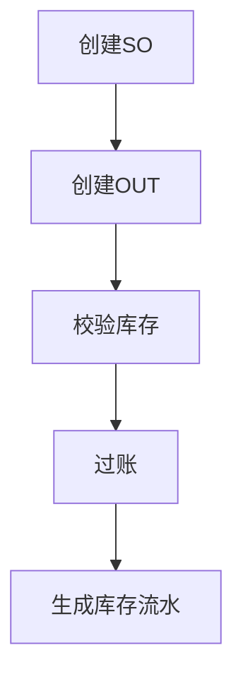
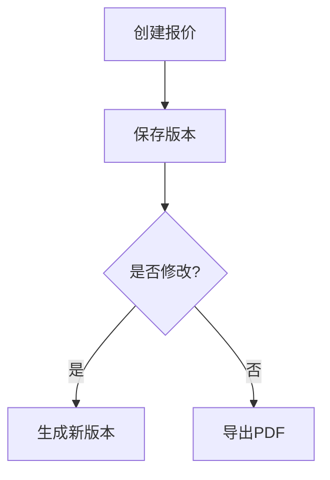
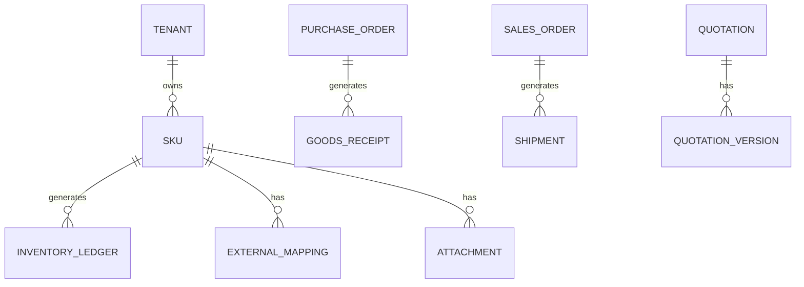

# 📘 MiniERP Cloud

## 多租户库存与报价中台系统

### 技术方案书（投标版）

---

# 第一章 项目背景与建设目标

## 1.1 项目背景

在电源仪器及配套行业中，企业普遍存在以下问题：

* SKU（Stock Keeping Unit，库存单位）数量大且规格复杂
* 供应商料号与内部料号混乱
* 入库与出库缺乏系统化管理
* 报价修改频繁但缺乏版本追溯
* 缺乏对外系统对接能力

随着业务规模扩大及数字化需求提升，企业亟需一套：

* 结构清晰
* 可扩展
* 可对外开放接口
* 适配小型团队使用场景

的库存与报价管理系统。

---

## 1.2 建设目标

本系统建设目标如下：

1. 建立统一 SKU 主数据管理体系
2. 实现库存基于流水驱动的精确管理
3. 构建可版本追溯的报价系统
4. 支持附件留痕与业务可追溯
5. 建设开放 API（Application Programming Interface，应用程序接口）平台
6. 构建多租户 SaaS（Software as a Service，软件即服务）架构

---

# 第二章 系统总体架构设计

---

## 2.1 架构概述

系统采用：

* 多租户架构（Multi-Tenant Architecture）
* 云部署模式
* 前后端分离架构
* GraphQL（Graph Query Language）+ REST 混合 API 架构
* OAuth2（OAuth 2.0 Authorization Framework）授权机制

---

## 2.2 架构图

---

## 2.3 多租户数据隔离

* 单数据库
* 所有核心表包含 tenant_id
* 所有请求自动注入租户上下文
* 严格禁止跨租户访问

---

# 第三章 功能模块设计

---

## 3.1 SKU 主数据管理模块

功能包括：

* 类目管理
* 规格模板管理
* 自动编码规则
* 外部料号映射
* 替代品双向关联
* 附件型知识管理

支持字段结构化管理，避免自由文本导致数据污染。

---

## 3.2 库存管理模块

库存模型：

* 单仓（Single Warehouse）
* 在手库存（On-Hand Inventory）
* 不支持负库存

库存计算基于库存流水（Inventory Ledger）。

---

## 3.3 采购管理模块

流程：

PO（Purchase Order，采购订单）
→ GRN（Goods Receipt Note，入库单）
→ 库存流水

支持：

* 分批到货
* 差异记录
* 附件上传

---

## 3.4 销售管理模块

流程：

SO（Sales Order，销售订单）
→ OUT（Shipment，出库单）
→ 库存流水

支持：

* 部分发货
* 单据作废
* 不允许负库存

---

## 3.5 报价管理模块

报价支持：

* 多版本管理
* 历史版本追溯
* PDF（Portable Document Format）导出
* 一键转换销售订单

版本采用不可变结构设计。

---

## 3.6 附件与留痕管理

统一附件表结构。

支持挂载：

* SKU
* 采购单
* 入库单
* 销售单
* 出库单
* 报价单

过账后不可删除，仅可追加。

---

# 第四章 核心业务流程

---

## 4.1 采购流程

---

## 4.2 销售流程

---

## 4.3 报价流程

---

# 第五章 数据模型设计

---

## 5.1 核心 ER 图

设计原则：

* 所有业务通过流水驱动
* 单据不可物理删除
* 数据结构支持未来扩展

---

# 第六章 开放平台设计

---

## 6.1 GraphQL API

提供：

* SKU 查询
* 库存查询
* 报价创建
* 单据查询

控制机制：

* 查询深度限制
* 复杂度限制
* 强制分页
* Rate Limit（速率限制）

---

## 6.2 OAuth2 授权

* Client Credentials 模式
* Scope 控制访问范围
* Token 绑定租户

---

# 第七章 非功能性设计

* 云部署
* HTTPS 加密传输
* 自动数据备份
* 图片对象存储
* 高可用数据库
* 并发控制机制

---

# 第八章 实施计划

建议实施周期：

阶段一（核心模块）
阶段二（开放平台优化）
阶段三（报表与扩展）

---

# 第九章 风险控制

| 风险     | 控制策略   |
| ------ | ------ |
| 数据泄露   | 多租户隔离  |
| 重复过账   | 幂等机制   |
| API 滥用 | 速率限制   |
| 数据误删   | 禁止物理删除 |

---

# 第十章 可扩展性

系统支持未来扩展：

* 多仓
* 批次管理
* 客户模块
* 财务系统
* SaaS 商业化运营

---

# 结语

MiniERP Cloud 系统采用先进的多租户架构与开放 API 设计，
在保证系统轻量化的同时，兼顾未来扩展与产品化能力，
适用于电源仪器及配套行业的数字化升级需求。

