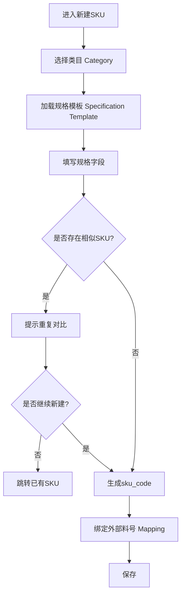
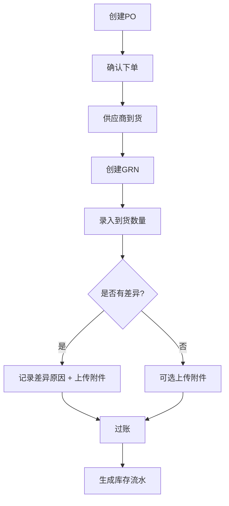
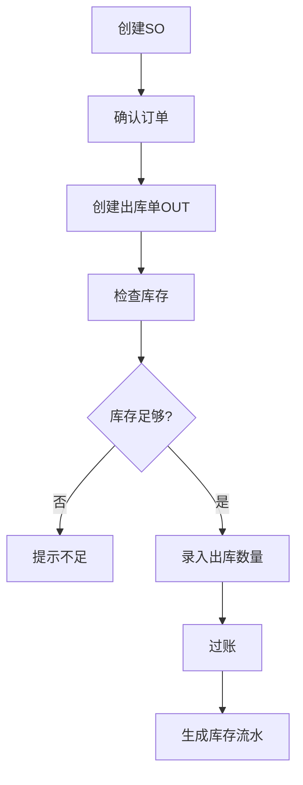
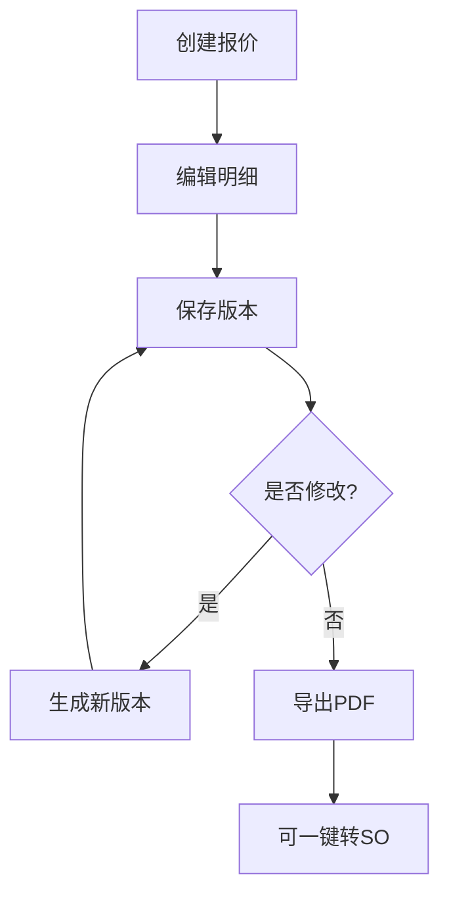
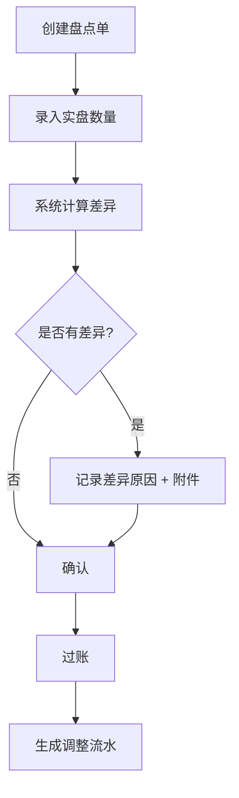
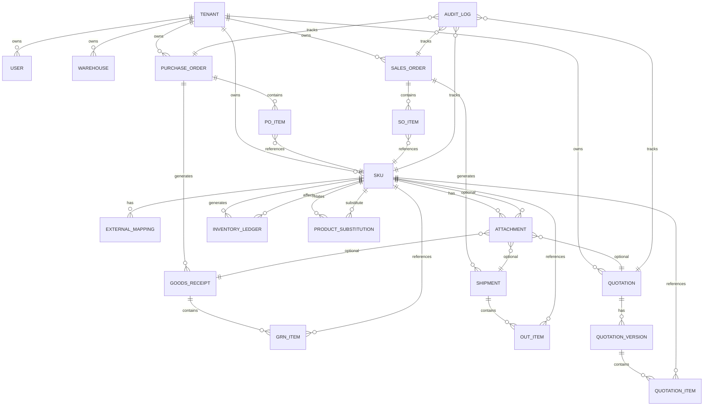

# 📄 产品需求文档 PRD v1.2（含流程图 + ER 图）

---

# 一、产品概述

产品名称：PowerSKU Cloud
产品类型：多租户（Multi-Tenant Architecture）库存与报价中台系统
部署方式：云部署

核心能力：

* SKU（Stock Keeping Unit，库存单位）主数据管理
* 库存管理（Inventory Management）
* 采购管理（Purchase Management）
* 销售管理（Sales Management）
* 报价版本管理（Quotation Versioning）
* 附件型知识库（Attachment-based Knowledge）
* GraphQL（Graph Query Language）开放 API
* OAuth2（OAuth 2.0 Authorization Framework）授权机制

---

# 二、系统总体架构

* 单数据库 + tenant_id 隔离
* GraphQL 对外开放
* REST（Representational State Transfer）用于命令型操作
* 单仓（Single Warehouse）
* 不支持负库存（No Negative Inventory）
* 单据不可删除，仅允许作废

---

# 三、核心业务主流程图

以下流程为系统核心业务路径。

---

## 1️⃣ SKU 新建流程

---

## 2️⃣ 采购流程（Purchase Flow）

PO（Purchase Order，采购订单）→ GRN（Goods Receipt Note，入库单）

---

## 3️⃣ 销售流程（Sales Flow）

SO（Sales Order，销售订单）→ OUT（Shipment，出库单）

---

## 4️⃣ 报价流程（Quotation Flow）

---

## 5️⃣ 盘点流程（Stocktake Flow）

---

# 四、核心 ER 图（实体关系图）

以下为系统核心数据结构关系图（结构级）。

---

# 五、数据结构逻辑说明

### 核心设计原则

1. 所有核心实体包含 tenant_id
2. 库存余额不直接修改，仅由 Inventory Ledger（库存流水）累计
3. 单据不可物理删除，仅允许作废
4. 报价使用不可变版本结构
5. 附件为统一表，按 entity_type + entity_id 关联
6. 替代品关系为自关联结构

---

# 六、GraphQL 对外模型逻辑

主要实体暴露：

* SKU
* InventoryBalance
* PurchaseOrder
* SalesOrder
* Quotation
* Attachment

强制：

* 分页
* 查询复杂度限制
* OAuth2 授权校验
* Scope 控制访问范围

---

# 七、系统边界总结

本系统为：

* 轻量库存与报价中台
* 非完整 ERP（Enterprise Resource Planning，企业资源计划系统）
* 支持 API 产品化
* 可未来扩展为 SaaS

---

# 八、产品成熟度评估

当前设计属于：

> 结构清晰的可产品化系统架构
> 不会因未来扩展推翻数据库
> 复杂度可控
